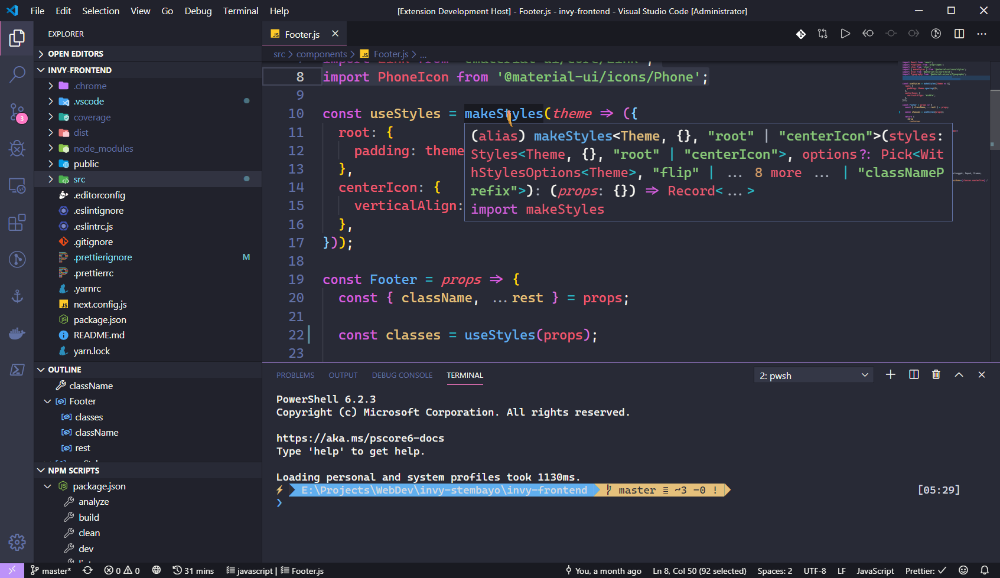

# `dark-party 🧛‍♂️🎉`

[![GitHub Workflow Status][workflow-image]][workflow-url]
[![Visual Studio Marketplace Downloads][vscm-image]][vscm-url]

**⚠️ Archived: Not maintained, I'm no longer use VSCode**

> **Dark Party VScode Theme**
>
> ✨ VSCode dark theme based on [Dracula theme](https://draculatheme.com/visual-studio-code) and [One Dark Pro](https://binaryify.github.io/OneDark-Pro) color token.
>
> For personal use, feel free to download if you want to use it too.

## Screenshot

**Enjoy!**

## Hacking to the Gate~! 🧑‍💻🎶

[MIT License](./license) © Latif Sulistyo

[discord-image]: https://img.shields.io/discord/758271814153011201?label=Developers%20Indonesia&logo=discord&style=flat-square
[discord-url]: https://discord.gg/njSj2Nq "Chat and discuss at Developers Indonesia"
[workflow-image]: https://img.shields.io/github/actions/workflow/status/latipun7/dark-party/ci-cd.yml?style=flat-square&logo=githubactions&label=CI%2FCD
[workflow-url]: https://github.com/latipun7/dark-party/actions "GitHub Actions"
[vscm-image]: https://img.shields.io/visual-studio-marketplace/d/ryuukibeat.dark-party?logo=visual%20studio%20code&style=flat-square
[vscm-url]: https://marketplace.visualstudio.com/items?itemName=ryuukibeat.dark-party "Download Dark Party VSCode Theme Now"
